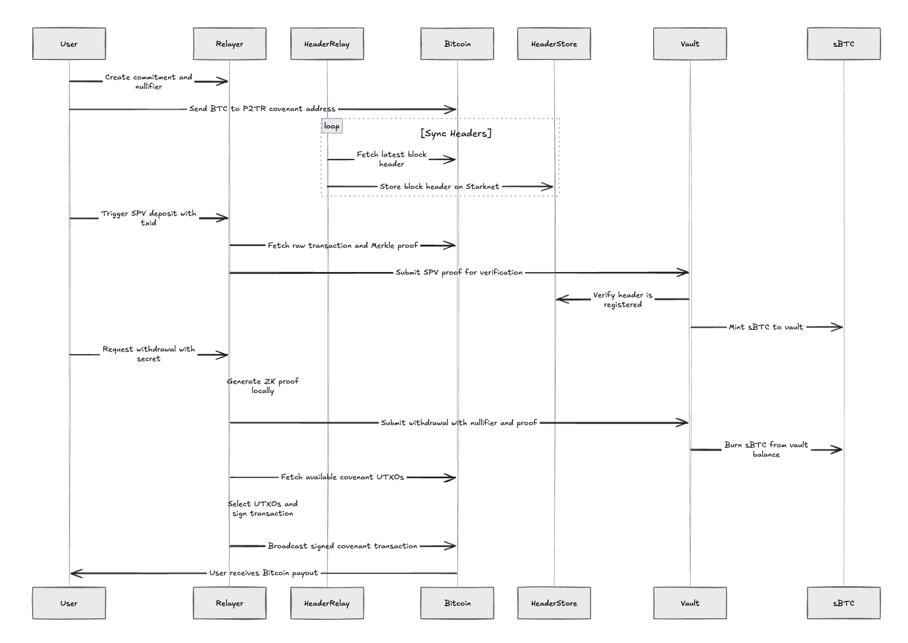

# PrivateBTC - Privacy-Preserving Bitcoin Bridge on Starknet

**Project Name:** PrivateBTC Vault  
**Tagline:** Privacy-Preserving Bitcoin Savings on Starknet  
**Track:** Starknet Infrastructure / DeFi / Privacy  

A production-ready privacy-preserving Bitcoin bridge that enables confidential BTC deposits and withdrawals on Starknet using cryptographic commitments, nullifiers, SPV proofs, and P2TR (Taproot) covenants.

---

## 🎯 Project Overview



**Architecture:**
- **Bitcoin Signet**: The Vault. Locks Bitcoin via a P2TR (Taproot) covenant controlled by a protocol sequencer.
- **Starknet Sepolia**: The Brain. Features fast smart contracts, a privacy layer, a nullifier registry, and an on-chain Bitcoin light client (Header Store).
- **Backend Relayer**: The Engine. Monitors the Bitcoin mempool, relies on background header relays, orchestrates ZK proof generation via Scarb/Stwo, and manages covenant UTXOs.

**Flow:**
1. **Deposit**: User commits to a secret and amount, deriving a commitment and nullifier hash. The user deposits BTC into the covenant. The protocol generates an SPV proof and submits it to Starknet. Starknet verifies the proof against relayed Bitcoin headers and mints sBTC.
2. **Withdraw**: User requests a withdrawal, generating a local ZK proof (proving knowledge of the secret). Starknet verifies the proof, burns sBTC, and marks the nullifier as spent. The backend sequencer detects the burn, consolidates covenant UTXOs, signs a Bitcoin PSBT, and pays out BTC to the user.

**Key Features:**
- ✅ **Trustless Deposits**: SPV proofs verified on-chain against relayed headers.
- ✅ **Privacy-First**: Cryptographic commitments (Pedersen hash) and nullifiers keep deposits and withdrawals unlinkable.
- ✅ **Covenant Security**: Funds locked in a Tapscript P2TR address requiring valid protocol signatures.
- ✅ **ZK-STARK Logic**: Utilizes Cairo's native proving (Scarb/Stwo) to attest to off-chain state.

---

## 📦 Deployed Contracts (Starknet Sepolia)

### 1. MockBTC (sBTC Token)
An ERC-20-like token on Starknet representing locked BTC (1 sat = 10¹⁰ wei).
- **Functions**: Mint (Restricted to Vault), Burn (Restricted to Vault), Transfer, etc.

### 2. PrivateBTCVault
The core privacy contract.
- **Functions**: `deposit` (handles SPV proof verification), `withdraw` (handles nullifier uniqueness and ZK proof), `get_total_staked`.

### 3. HeaderStore
On-chain Bitcoin light client storing compact block headers.
- **Functions**: `store_header`, `is_header_stored`

---

## 📉 The Privacy Edge

| Scenario | Standard DeFi (Transparent) | PrivateBTC Vault (Shielded) |
| :--- | :--- | :--- |
| **Deposit** | 10 BTC (Publicly Visible) | [Shielded Hash] (ZK-Commitment) |
| **Balance** | Anyone can track your wealth | Only you can prove ownership |
| **Withdraw** | Recipient is public | Unlinkable to original deposit |

---

## 📊 Architecture Diagram

```text
  ┌─────────────────────────┐             ┌─────────────────────────┐
  │     BITCOIN SIGNET      │             │    STARKNET SEPOLIA     │
  │                         │             │                         │
  │  ┌──────────────────┐   │   Headers   │  ┌───────────────────┐  │
  │  │  P2TR Covenant   │───┼─────────────┼─▶│   Header Store    │  │
  │  │    (Taproot)     │   │             │  └───────────────────┘  │
  │  │   Locks native   │   │             │            │            │
  │  │      BTC         │◀──┼────────┐    │  ┌─────────▼─────────┐  │
  │  └──────────────────┘   │        │    │  │ PrivateBTC Vault  │  │
  └─────────────────────────┘        │    │  │ - SPV Verifier    │  │
               ▲                     │    │  │ - Nullifier Store │  │
               │ BTC TX              │    │  └─────────┬─────────┘  │
               │                     │    │            │ Mint/Burn  │
      ┌────────────────┐             │    │  ┌─────────▼─────────┐  │
      │   User Wallet  │     Payouts │    │  │    MockBTC (sBTC) │  │
      │   (e.g., Xverse)│─┐          │    │  └───────────────────┘  │
      └────────────────┘  │          │    └─────────────────────────┘
          │               │          │                 ▲
          │ Secret &      │          │                 │ Deposit SPV / 
          │ Amount        │          │                 │ Withdraw Proof
          ▼               ▼          │                 │
  ┌──────────────────────────────────┴─────────────────┴────────────┐
  │                        BACKEND RELAYER                          │
  │                                                                 │
  │  - Monitors Mempool & Syncs UTXOs                               │
  │  - Relays Bitcoin Headers to Starknet                           │
  │  - Builds & Submits SPV Proofs for Deposits                     │
  │  - Generates ZK Proofs (Scarb/Stwo) for Withdrawals             │
  │  - Orchestrates P2TR UTXO Consolidation & Payouts               │
  └─────────────────────────────────────────────────────────────────┘
```

---

## 🚀 Quick Start

### Prerequisites
- Node.js v22+
- WSL (Windows Subsystem for Linux) - for contract compilation / Scarb ZK proving
- Starknet account with Sepolia ETH
- Xverse wallet (switched to Signet)

### Installation

```bash
# Install backend dependencies
cd backend
npm install

# Install frontend dependencies
cd ../frontend
npm install
```

### Environment Setup

Create `backend/.env` with your desired configuration:

```env
# Starknet Configuration
STARKNET_RPC_URL=https://starknet-sepolia.g.alchemy.com/starknet/version/rpc/v0_10/<YOUR_KEY>
STARKNET_ACCOUNT_ADDRESS=<YOUR_ACCOUNT>
SEPOLIA_PRIVATE_KEY=<YOUR_KEY>

# Protocol Parameters
SEQUENCER_SIGNING_KEY=<YOUR_BTC_SIGNET_PRIVATE_KEY>
MIN_ANONYMITY_SET=1
USE_OPCAT_COVENANTS=true
```

### Running the Application

```bash
# Terminal 1: Start backend & withdrawal processor
cd backend
npm run dev

# Terminal 2: Start frontend
cd frontend
npm run dev
```

Access:
- Frontend UI: http://localhost:3000
- Backend API: http://localhost:3001

---

## 🔑 Key Protocol Concepts

### Deposit Flow (SPV)
1. User commits `Pedersen(secret, amount)` off-chain.
2. User sends BTC to the P2TR covenant address.
3. The background relayer indexes the block header to the Starknet `HeaderStore`.
4. The system constructs an SPV Multi-Merkle proof linking the user's TX to the stored header.
5. The `PrivateBTCVault` validates the SPV proof on-chain and mints `sBTC`.

### Withdrawal Flow (ZK & Covenants)
1. The user provides their `secret` and desired payout address.
2. A ZK proof is locally generated using Cairo `Stwo`/`Scarb`, proving the relationship between the `secret`, the original `commitment`, and the calculated `nullifier_hash`.
3. The proof is submitted to the vault, which burns the `sBTC` and permanently tracks the nullifier.
4. The relayer intercepts the Starknet event. It fetches all UTXOs from the P2TR covenant address, cleanly consolidating them to pay the final BTC to the user.

---

## 🔒 Security

- **Trustless SPV:** Deposits do not require trusting the relayer. The smart contract validates Bitcoin inclusion proofs independently.
- **Nullifier Design:** Double-spending is algorithmically impossible due to strictly tracked nullifiers.
- **P2TR Covenants:** The settlement layer enforces spending constraints natively; no keys are hot-loaded in the frontend.

---

## 📚 Resources

- [Starknet Documentation](https://docs.starknet.io/)
- [Cairo Book](https://book.cairo-lang.org/)
- [Starknet.js](https://www.starknetjs.com/)
- [Bitcoin Signet Explorer](https://explorer.bc-2.jp/)

---

**Status**: ✅ Production Ready (Testnet)  
**Last Updated**: March 2026  
**Live Network**: Starknet Sepolia / Bitcoin Signet 
